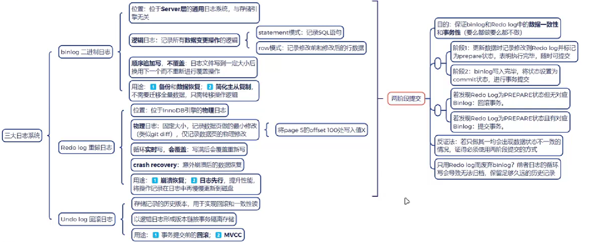
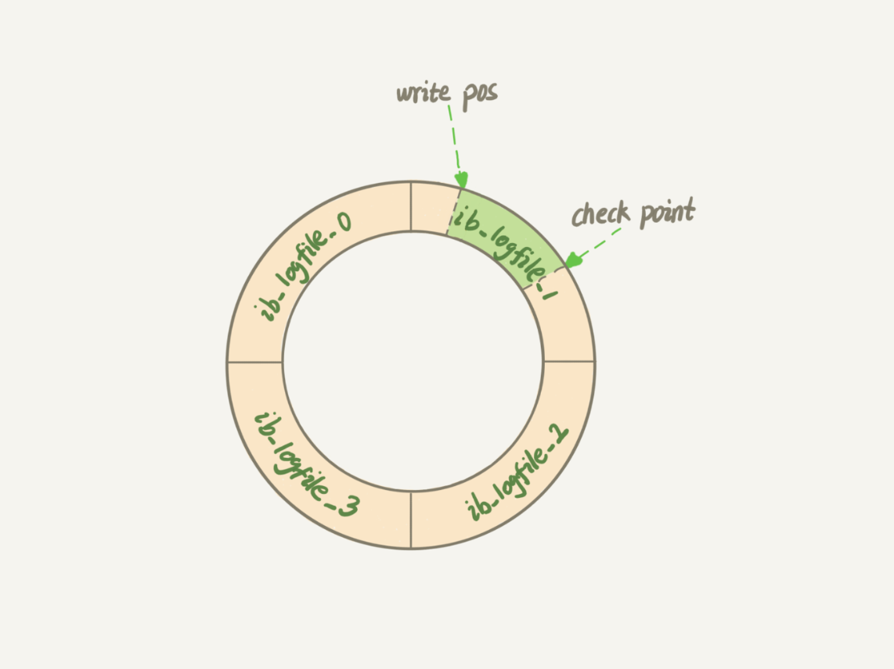

[[MySQL]]

 对于更新流程，涉及两个重要的日志模块。redo log（重做日志）和 binlog（归档日志)。

## redo log 重做日志

**WAL 预写式日志：先写日志，再写磁盘**

当有一条记录需要更新的时候，InnoDB 引擎就会先把记录写到 redo log，并更新内存。

对于 redolog 的更新流程：

- InnoDB 的 redo log 是固定大小的，写完了就回到开头循环写。

- write pos 是当前记录的位置，一边写一边后移，写到第 3 号文件末尾后就回到 0 号文件开头。

- write pos 和 checkpoint 之间空着的部分可以用来记录新的操作。

## binlog 二进制日志

Server 层也有自己的日志，称为 binlog（归档日志）。用于备份、主从。

**binlog 与 redo log 的区别**

1. redo log 是 InnoDB 引擎特有的；binlog 是 MySQL 的 Server 层实现的。
2. redo log 是物理日志, 记录的是“在某个数据页上做了什么修改”; binlog 是逻辑日志，记录的是这个语句的原始逻辑。
3. redo log 是循环写的, 空间固定会用完；binlog 是可以追加写入的。

## InnoDB 的两阶段提交

**目的**：保证 BinLog 和 RedoLog 的一致性和事务性

- 阶段 1：更新数据时记录 RedoLog 并标记为 prepare，等待提交
- 阶段 2：BinLog 写入完毕之后，将状态设置为 commit，提交

若 RedoLog 与 BinLog 状态一致，提交事务。

若 RedoLog 与 BinLog 状态不一致（RedoLog 为 prepare 但 BinLog 无对应记录），回滚。
